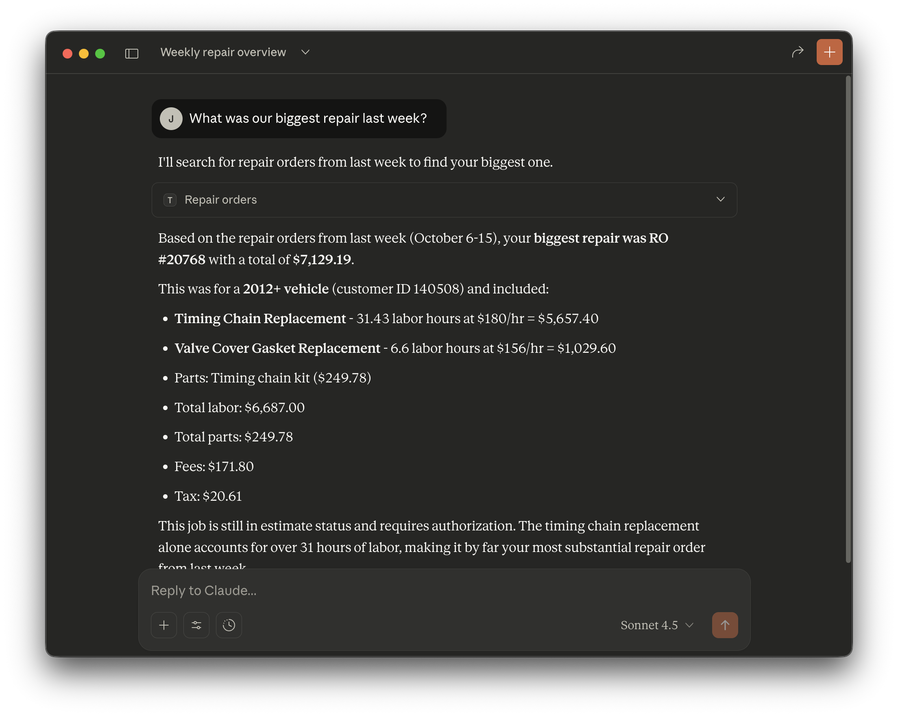

# Tekmetric MCP Server

Ask questions about your shop data using natural language. Get instant answers about customers, vehicles, repair orders, appointments, and more - directly in Claude.

<p align="center">
  
</p>

> **⚠️ Independent Community Project**
>
> This is an **independent, community-built tool** that integrates with Tekmetric's API. It is **not an official Tekmetric product** and is not affiliated with, endorsed by, or supported by Tekmetric, Inc.
>
> For official Tekmetric products and support, visit [tekmetric.com](https://tekmetric.com).

## What You Can Do

### Today's Schedule

```
Show me today's appointments
```

```
What repair orders are in progress?
```

### Find Customers & Vehicles

```
Find customer John Smith
```

```
Search for a 2020 Honda Accord
```

```
Look up VIN 1HGBH41JXMN109186
```

### Check Recent Work

```
Show me estimates from last week
```

```
Find repair orders for customer 456
```

```
What vehicles does customer 123 own?
```

### Analyze Service History

```
Analyze the service history for vehicle 12345
```

Get a complete timeline with:
- All services and parts replaced
- Spending patterns and maintenance adherence
- Recurring issues and recommendations
- Formatted as clean markdown tables

## Features

- **Natural Language** - Just ask questions, no commands to memorize
- **Real-Time Data** - Direct access to your Tekmetric data
- **Smart Search** - Find anything by name, VIN, date, status, and more
- **Service History Analysis** - Complete vehicle timelines with AI-powered insights
- **Rich Context** - See customer names, vehicle details, and formatted prices automatically
- **Fast & Lightweight** - Single binary, no dependencies, instant responses

## What This Is For

**Best for tactical, day-to-day queries:**
- Look up customer contact info
- Find vehicle details by VIN or license plate
- Check appointment schedules
- Search for specific repair orders
- Analyze complete service history timelines
- Get technician assignments

**NOT designed for:**
- Financial reporting or accounting (use Tekmetric's built-in reports)
- Revenue calculations or profit analysis
- Large-scale data exports
- Business intelligence dashboards

> **Note:** Results are limited to 25 records per query to keep responses fast. For comprehensive financial data or bulk exports, use Tekmetric's native reporting tools.

## 🚀 Quick Start

### 1. Get API Credentials

**Important:** API access must be requested from Tekmetric.

1. Visit [shop.tekmetric.com](https://shop.tekmetric.com) to request API access
2. Wait 2-3 weeks for approval
3. Receive your Client ID and Client Secret from Tekmetric
4. Save them securely

### 2. Install

#### Desktop Extension (Easiest)

1. Download `tekmetric-mcp.mcpb` from [releases](https://github.com/beetlebugorg/tekmetric-mcp/releases)
2. Open the `.mcpb` file with Claude Desktop
3. Configure your API credentials
4. Start asking questions!

#### Manual Installation

Add to your Claude Desktop config (`~/Library/Application Support/Claude/claude_desktop_config.json` on macOS):

```json
{
  "mcpServers": {
    "tekmetric": {
      "command": "/absolute/path/to/tekmetric-mcp",
      "args": ["serve"],
      "env": {
        "TEKMETRIC_CLIENT_ID": "your_client_id",
        "TEKMETRIC_CLIENT_SECRET": "your_client_secret",
        "TEKMETRIC_BASE_URL": "https://shop.tekmetric.com",
        "TEKMETRIC_DEFAULT_SHOP_ID": "123"
      }
    }
  }
}
```

### 3. Restart Claude Desktop

Quit and reopen Claude Desktop. Look for the 🔌 icon to verify connection.

## What Data You Can Access

**Shops** - View shop details, hours, labor rates, and settings

**Customers** - Search by name, email, phone; view contact info and service history

**Vehicles** - Find by VIN, license plate, make/model; see service records

**Repair Orders** - Filter by status, date, customer, vehicle; track work and revenue

**Jobs** - View individual services, labor, parts, and technician assignments

**Appointments** - Search by date, customer, vehicle; manage scheduling

**Employees** - List technicians and staff, filter by role and status

**Inventory** - Check parts stock levels and availability (Beta)

**Analysis Tools** - Get comprehensive vehicle service history with intelligent formatting

## Example Queries

### Basic Lookups

```
Show me today's appointments
```

```
Find customer with phone 555-1234
```

```
Show me repair orders from last week
```

```
Search for vehicles by VIN
```

```
List all employees
```

```
What's in inventory?
```

### Service History Analysis

```
Analyze service history for vehicle 12345
```

This returns a complete timeline showing:
- Every service visit with dates and mileage
- All services performed and parts replaced
- Labor hours and costs
- Customer concerns reported
- Formatted as scannable markdown tables
- Automatic categorization (oil changes, brakes, etc.)
- Spending patterns and maintenance insights

## 📚 Documentation

- **[Full Documentation](https://beetlebugorg.github.io/tekmetric-mcp/)** - Complete guide with examples
- **[Tool Reference](https://beetlebugorg.github.io/tekmetric-mcp/tools/)** - All available tools and parameters
- **[Contributing](./docs/docs/contributing.md)** - How to contribute (AI-first approach)

## 🔒 Security & Privacy

- **Read-Only Access** - Cannot modify your Tekmetric data
- **Your Credentials** - API keys stored locally, never sent to third parties
- **Direct Connection** - Communicates directly with Tekmetric API
- **Open Source** - Full code transparency

## 🤝 Contributing

This is an AI-first project! We prefer clear requirements documents over code submissions. See our [Contributing Guide](./docs/docs/contributing.md) to learn how to contribute using requirements instead of pull requests.

## 🐛 Found a Bug?

[Open an issue](https://github.com/beetlebugorg/tekmetric-mcp/issues) with:
- What you asked
- What you expected
- What actually happened

---

## Technical Details

### Requirements

- Go 1.23+ (for building from source)
- Tekmetric API credentials
- Claude Desktop app

### Build from Source

```bash
git clone https://github.com/beetlebugorg/tekmetric-mcp.git
cd tekmetric-mcp
make build
```

### Configuration

Environment variables:

| Variable | Description | Required |
|----------|-------------|----------|
| `TEKMETRIC_CLIENT_ID` | API Client ID | Yes |
| `TEKMETRIC_CLIENT_SECRET` | API Client Secret | Yes |
| `TEKMETRIC_BASE_URL` | API URL (sandbox or production) | No |
| `TEKMETRIC_DEFAULT_SHOP_ID` | Default shop ID | No |
| `TEKMETRIC_DEBUG` | Enable debug logging | No |

### Technology Stack

- **Go 1.23+** - Fast, compiled binary
- **MCP SDK** - Model Context Protocol
- **OAuth 2.0** - Secure authentication
- **Rate Limiting** - Automatic retry with backoff

### Troubleshooting

**Connection Issues:**
- Verify absolute paths in config
- Check binary is executable
- View Claude Desktop Developer Tools

**Authentication Failed:**
- Verify Client ID and Client Secret
- Check correct base URL (sandbox vs production)
- Try regenerating API credentials

**Rate Limiting:**
- Server automatically retries with backoff
- Reduce request frequency if needed

Enable debug mode:
```bash
tekmetric-mcp -d serve
```

## 📄 License

MIT License - see [LICENSE](LICENSE) file

**Disclaimer**: Provided "as-is" without warranty. Test in sandbox first. Not affiliated with Tekmetric, Inc.

---

**Built with 🤖 + 💻 | [GitHub](https://github.com/beetlebugorg/tekmetric-mcp) | [Docs](https://beetlebugorg.github.io/tekmetric-mcp/)**
